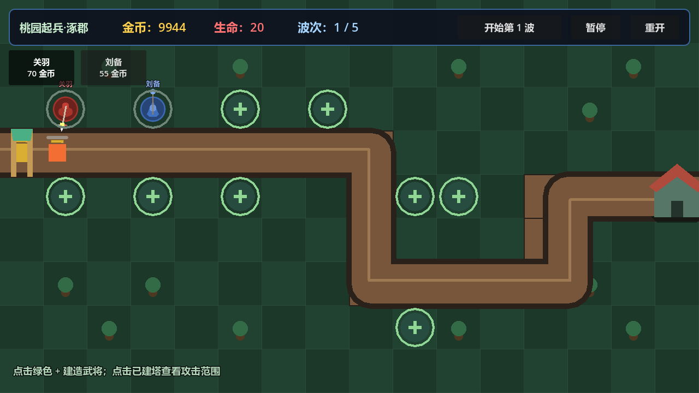

# 烽火连营 · 三国塔防（TowerDefense）

三国题材章节制塔防：**塔就是三国武将**。每位武将拥有职业（骑兵、枪兵、弓箭手、术士、舞娘）、等级经验、转职路线与技能；剧情从黄巾之乱开始，一路守到五丈原。



## 当前状态：Stage 0 可玩版本

- 可玩关卡：`ch01_s01 桃园起兵·涿郡`（5 波，黄巾步卒 / 轻骑 / 伍长）
- 可出战武将：刘备（术士）、关羽（骑兵），新档自动解锁
- 数据驱动：关卡、波次、敌人、武将全部由 `.tres` 资源配置，脚本无硬编码内容
- 网格地图：80px 棋盘格瓦片、直角瓦片道路、建造位严格对齐网格
- 武将矢量造型：按职业绘制（骑兵骑马持枪、术士袍杖），弹道按职业区分
- 通关结算：经验 / 首通解锁 / 掉落写入存档；失败不产生任何成长

## 玩法操作

1. 顶部建造栏选择武将（刘备 / 关羽）
2. 点击地图上的绿色 `+` 建造位部署武将塔
3. 点击「开始第 N 波」放怪，点击已建塔可查看攻击范围
4. 漏怪扣基地生命，守住全部波次即胜利

## 运行与测试

- 引擎：Godot 4.7（GL Compatibility），分辨率 1280×720
- 运行：用 Godot 打开 `project.godot` 按 `F5`
- 冒烟测试：`tests/SmokeRunner.tscn`
- 存档契约测试：`tests/Stage0Runner.tscn`
- 视觉预览：`tests/VisualPreviewRunner.tscn`

## 目录结构

```
scripts/      战斗逻辑与数据类（data / services）
scenes/       主场景、塔、敌人、子弹、建造位、UI
resources/    数据资源（章节 / 关卡 / 角色 / 职业 / 敌人 / 道具 / 转职）
tests/        自动化测试与预览场景
docs/         设计文档与截图
assets/       正式美术资源（暂空，当前为程序化矢量占位）
```

## 开发路线

| 阶段 | 内容 | 状态 |
|---|---|---|
| 0 | 项目骨架、数据闭环、可玩单关 | ✅ 完成 |
| 1 | 主菜单、选关、编队、结算流程闭环 | 进行中 |
| 2 | 角色养成（升级 / 一转） | 待开发 |
| 3 | 第一章内容补全（8 关、全角色、怒气大招与特性） | 待开发 |
| 4 | 掉落与抽奖（求贤令） | 待开发 |
| 5 | 技能、怒气大招与演出差异化 | 待开发 |
| 6 | 多分支转职、二次转职与扩展地基 | 远期 |

完整设计基准见 [docs/GAME_DESIGN.md](docs/GAME_DESIGN.md)。